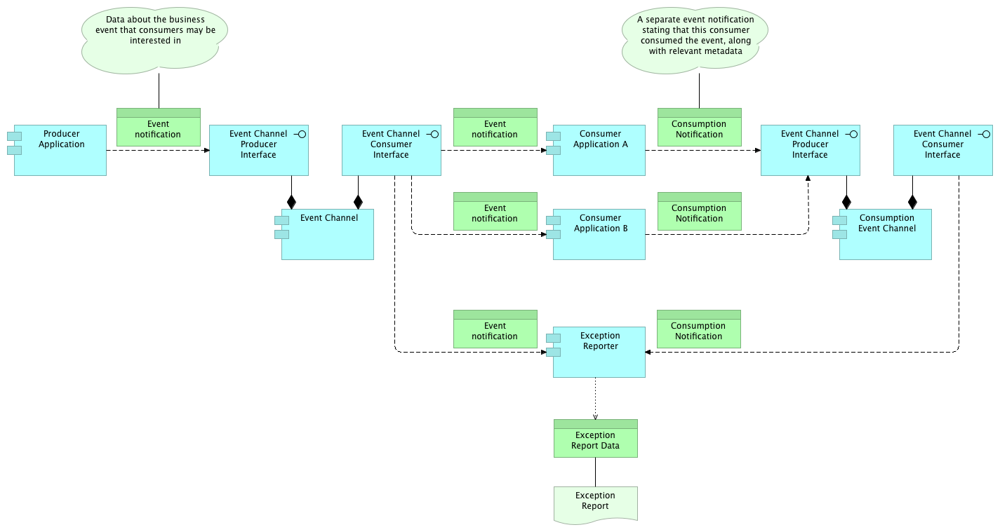

# Approach to Event-Driven Architecture

Early draft - not official

This is a first draft, and has not been reviewed or accepted by the Enterprise Architecture team. It is not yet official or recommended.

# Problem

You want to use event-driven architecture to produce event notifications in response to state change so that event consumers can react to events in a loosely coupled manner. You want to know how to deal with considerations like selecting the right message channel.

# Solution

Publish events from your application to an event channel so that consumers can integrate with your application in a loosely coupled manner to react to events that indicate state change for the data elements that your application is authoritative for.

## Discussion

## Event-Driven Architecture
Event-Driven Architecture is an architectural pattern that is based on publishing event notifications in response to a change in state (i.e. an event), and reacting to those events in a loosely coupled manner.

### Fundamentals of event-driven architecture

#### Terminology
An event-driven architecture includes:

1. **Events** - A significant change in state. Events do not travel, they just happen. Note that 'event notifications' are often referred to simply as events as a form of shorthand, which can lead to confusion.
2. **Event notifications** - A message that is sent (typically asynchronously) to registered event consumers over an event channel to inform them of the event that happened.
3. **Event producers** - Publish event messages to event channels when the state of a resource changes. An event producer does not know about event consumers (i.e. whether they exist, how many there are, how events are or are not used by event consumers).
4. **Event consumers** - React to events. Event consumers do not know about one another.
5. **Event channels** - Conduits through which event notifications travel from event producers to event consumers. Examples include JMS topics, atom feeds, AWS Kinesis streams, etc.

#### Principles
Event-driven architecture is fundamentally different than request-driven service oriented architecture. Here are some of the fundamental aspects of this architectural style:

- Asynchronous “Push”-Based Messaging Pattern
Instead of the traditional “pull”-based synchronous request/response model
   - event-driven architecture implements the [Publish-Subscribe Channel](http://www.enterpriseintegrationpatterns.com/patterns/messaging/PublishSubscribeChannel.html) messaging pattern to “push” notifications out to interested listeners, in a “fire-and-forget” (does not block and wait for a synchronous response), uni-directional, asynchronous interaction.
- Autonomous Messages
   - Each message contains just enough information to describe a change in state such that event consumers can take appropriate action.
   - Each event notification stands on its own and does not require additional context such as in-memory session state of the event consumers.
- Higher decoupling of distributed systems      
   - Reduced contract coupling (see below for more discussion)
   - Event producers do not need to know about event consumers (see below for more discussion)             
   - Functional processes in the sender system, where the business event took place, do not depend on the availability and completion of remote processes in downstream distributed systems.
   - Unlike in a request-driven architecture, event producers do not depend on the availability and completion of remote functions in event consumer systems in order to successfully complete their own processing.
   - In synchronous request-driven architectures, connected systems are often required to meet the service-level requirements (i.e., availability and throughput) and scalability / elasticity of the system that has the highest transaction volume. But in asynchronous event-driven architectures, the SLA concerns of one system do not dictate the concerns of dependent systems, providing these teams with more design-time autonomy over things like infrastructure design.
   - This also means that changes to each connected system can be deployed more independently (and thus more frequently) with minimal impact to other systems, due to the overall reduced dependencies.

#### Benefits
Benefits of Event-Driven Architecture include:

1. Improves flexibility and reliability
   - Enables more resilient design, since event notifications are asynchronous, meaning that a failure in an event consumer does not affect the event producer's availability.
   - Event emitters don't need to know about their consumers so application dependencies are minimized. Changes to an event consumer do not affect an event producer.
   - Set of consumers can change over time without modifying event emitter. New consumers can be added, and existing consumers removed without affecting the event producer.
2. Allows an event producer to broadcast a single event to multiple event consumers.
3. Enables effective data integration
   - Event-driven architecture is inherently based on data about updates to business state. No central data coordination is required - interested consumers can simply subscribe to data feeds to obtain data updates they care about.
   - Ingestion of data into a data warehouse is simpler (see below for discussion).
4. Reduced information latency
   - Event notifications are delivered in near real-time.
   - Operational systems can have the most accurate, current view of the state of business.
5. Improved scalability
   - Asynchronous systems tend to be more scalable than synchronous systems.
6. Improved business agility
   - Allows different functional domains to interact while preserving a high degrees of local autonomy.
   - Business concepts and activities are modeled in simpler terms with responsibilities appropriately delegated to corresponding owners.
   - Reduced dependencies allow technical and functional changes to be planned and released more independently and frequently, achieving a higher level of IT agility and, hence, business agility.

### Event Processing Styles

An event-driven architecture includes at least one of these styles, or may include any combination of these styles:

1. *Simple event processing*: Concerns events that are directly related to specific, measurable changes of state. In simple event processing, a notable event happens which initiates downstream action(s). An example of a simple event is a new account being created.
2. *Event stream processing*: In event stream processing, notable event notifications are mixed in with ordinary event notifications in the event channel. Event consumers filter the event stream to identify and react to the notable events. An example of event stream processing is a temperature sensor in a data center hall. Most of the readings will be ordinary (i.e. within threshold), but some events will be notable (i.e. because they exceed threshold boundaries). This style allows the threshold business logic to live in the consumer rather than the producer.
3. *Complex event processing*: Allows a pattern of events to indicate that something has happened. The events (notable or ordinary) may cross event types and occur over a long period of time. The event correlation may be causal, temporal, or spatial. An example of complex event processing is identifying a security breach from a stream of events that, taken on their own may seem innocuous, but when considered as a whole, indicate a system compromise. This style allows complicated business logic to be implemented in a source that considers many inputs without needing to embed any business logic or dependencies within those individual input systems.

### Event Taxonomy
Event-driven architecture benefits from a clearly defined and standardized event taxonomy so that the events are meaningful and can be easily understood.

### Event notification contracts
As discussed above, event-driven architecture limits coupling between event producers and event consumers. This is desirable because it improves design-time autonomy for the owners of these systems, as well as run-time autonomy for the operators of the systems.

Other than the details of connecting to the event channel for sending and getting event notifications, this asynchronous message-based interaction model does not need to be as concerned with some aspects of request-response models such as input parameters, service interface definitions such as RAML, and fine-grained security.

One area in which coupling cannot be avoided is the representation of the event details in the event notification. We'll refer to this as the event notification contract.  

As explained in the [Rackspace SOA Guidelines](https://one.rackspace.com/download/attachments/49480223/RackspaceSOAGuidelines_v2.0_DRAFT1.pdf?version=1&modificationDate=1390945322000&api=v2), *Consumer-to-Contract* coupling is a desirable form of coupling that occurs when consumers use services through published, standardized contracts.

It is important that event producers publish a contract for the representation of event notifications that will appear on the event channel. This may be an XML schema or JSON schema, for example.

### Pipes and filters

Event-driven architecture permits event consumers to also be event producers (typically on a different event channel), which means that it is possible to chain together event processors as described by the [pipes and filters enterprise integration pattern](http://www.enterpriseintegrationpatterns.com/patterns/messaging/PipesAndFilters.html).

This may be useful for architects who wish to decompose a task that performs complex processing into a series of discrete elements that can be reused. This pattern can improve performance, scalability, and reusability by allowing task elements that perform the processing to be deployed and scaled independently.

### Event sourcing
Event-driven architecture enables the [Event Sourcing](http://martinfowler.com/eaaDev/EventSourcing.html) pattern. Event Sourcing ensures that all changes to application state are stored as a sequence of events. Not only can we query these events, we can also use the event log to reconstruct past states or to rebuild state to recover from a fault in the primary data store.

Event sourcing can also be combined with the [Command and Query Responsibility Segregation (CQRS) Pattern](http://martinfowler.com/bliki/CQRS.html) to address non-functional requirements like performance, scalability, security, and flexibility.

Event sourcing is a large topic, and we won't cover it in detail in this entry. The interested reader is referred to [Martin Fowler's Blog Post on the Event Sourcing Pattern](http://martinfowler.com/eaaDev/EventSourcing.html), and to the book [Implementing Domain Driven Design](https://www.amazon.com/Implementing-Domain-Driven-Design-Vaughn-Vernon/dp/0321834577) by Vaughn Vernon.

### Ingesting events into the data lake

For the purposes of this discussion it is important separate the idea of a *data lake* from that of a *data warehouse*.

The [NIST Big Data Interoperability Framework V1.0](http://www.nist.gov/itl/bigdata/bigdatainfo.cfm) states that:

> In a volume use case, the data is often stored in the raw state in which it was produced before being cleansed and organized (sometimes referred to as extract-load-transform). The consequence of persistence of data in its raw state is that a schema or model for the data is only applied when the data is retrieved for preparation and analysis. This Big Data concept is described as schema-on-read.

The term "data lake" refers to the placing of raw data into large repositories – typically Hadoop Distributed File System (HDFS), the storage system used by Hadoop – without any transformation. “Schema-on-read” means you do not need to know how you will use your data when you are storing it. This allows you to innovate quickly by asking originally unanticipated questions after storing the data.

James Dixon, the founder and CTO of Pentaho, has been credited with coming up with the term. This is how he describes a data lake:

> If you think of a datamart as a store of bottled water – cleansed and packaged and structured for easy consumption – the data lake is a large body of water in a more natural state. The contents of the data lake stream in from a source to fill the lake, and various users of the lake can come to examine, dive in, or take samples.”

Mark Jacobsohn, Senior Vice President Booz Allen Hamilton and Michael Delurey,
Principal at Booz Allen Hamilton write in [How the Data Lake Works](https://www.boozallen.com/content/dam/boozallen/documents/Data_Lake.pdf) that:

> With the conventional approach, organizations may be reluctant to add new data sources — no matter how promising — because they fear the time and expense may outweigh the possible benefit. But with the Data Lake, organizations can add new data sources with little or no risk. This is possible because of two powerful features of the Data Lake’s schema-on-read approach: all types of data can be ingested quickly and storage is inexpensive, and data can be stored in HDFS until it is ready to be analyzed.
> 
> Say an organization has 20 new potential data sources, but does not know in advance which ones, if any, might be useful. An organization using the conventional schema-on-write may be reluctant to add any of the sources. But, the Data Lake actually encourages organizations to add new data sources because the time and resources needed are significantly reduced. Organizations need not fear adding what might be useless information; in a sense, there is no useless information in the Data Lake.

In a data lake, data can be analyzed without constraints of preconceived structure. It is therefore natural and desirable to automate the import of data into the data lake from event notifications found on event channels.

However in most cases, analytics ultimately requires a schema to do analysis. An important consideration of capturing this raw data is associating it with metadata about the data such as the provenance of the data, the time of its publication, schema describing the format and structure of the data.

Since event notifications have data that may be of interest for reporting purposes, especially when the event sourcing pattern is used (see above), we should consider how to get event notification data into the data warehouse.

When sourcing data from a message channel that contains data and metadata the ingestion process can be fully automated, reacting to new or updated event notifications schemas and/or event channels by:

1. The ingestion process reads event channel metadata and recognizes that there is a new event channel and/or event notification schema
2. Ingestion process creates location in Data Lake where the new object will be loaded
3. The ingestion process reads the event notification schema
4. The ingestion process saves a reference to / copy of the event notification schema so that analysts can subsequently query the data (e.g. using Hive)
5. The ingestion process start loading the event notification data into the data lake

Automating the process of ingesting event notification data into the data lake enables the enterprise to bring data into analytical side of the house quickly and reliably and with no human intervention. New objects and attributes will be available in the Data Lake as soon as they appear on an event channel. This will enable analysts to consume new objects and attributes immediately after new features or functionality are released that include eventing in the integration architecture.

One obvious way for this to happen is simply to create an extract process that acts as a consumer of event notifications on the appropriate event channel, and saves the event payload data and related schema information into the data lake.

Another possibility is to have an integration from the event channel to the data warehouse directly. In this scenario, the event notifications are published to the event channel by the event producer, and the event channel persists the event notification into a data store that an ETL process is configured to integrate with.  However this approach leads to consumer-to-technology coupling, which is an undesirable form of coupling, and so we prefer the first option.

# Good and Bad Practices

## Good Practices

1. Publish the event notification representation contract so that consumers can couple to this well-defined contract.
2. Follow the guidance found in [Selecting an Event Channel for Event-Driven Integration](../service-design/selecting-an-event-channel.md) to select the best technology to use to realize an event channel in your application-to-application integration architecture.

## Bad Practices

None

# Unresolved Issues

None

# Frequently Asked Questions

The following are frequently asked questions whose answers are worth collecting in one place.

#### *When should I use events, and when should I prefer synchronous API requests?*

Synchronous requests are appropriate when the event source (or client) depends on the receiver (or server) to perform and complete a function as a component of its own process execution.  This is most often found in the case of reuse of existing business logic / application function.

#### *How much data should be communicated via event notifications? What should I include in my event notification payload? How is this different from database replication?*

The purpose of an event notification is to inform event consumers about  changes in the state of a resource. Therefore, only data that is meaningful to the event that transpired should be included in the event notification payload.

A good rule of thumb is to include just enough data to help event receivers decide how to react to the event. If event consumers require more data or functional interaction to complete their processes they can use alternative integration interfaces such as synchronous REST API calls to accomplish that part of the interaction.

#### *How can I know whether an event is consumed by a particular consumer?*

In the event-driven architectural style, event producers "fire and forget" the event notification messages. By design, producers are loosely coupled with consumers and don't know about whether there are any consumers, nor the status of the consumers.

However, it is obviously desirable from an enterprise perspective to ensure that events are being consumed and are not lost. Consider for example an event channel that carries usage events for a product billed on a utility basis such as a cloud computing virtual machine. The enterprise has a regulatory obligation to ensure that all of these usage events are streamed into the billing and rating pipeline so that customers are billed appropriately and revenue is not under-reported.

There are several architectural options available that achieve the goal of assuring that event consumers receive and process all event notifications as expected.

One option is simply to create an exception report that compares all of the event notifications published onto the event channel against a log of all event notifications consumed by the event consumer.

On a publish/subscribe event channel, it is trivial for a reporting process to become an additional consumer of event notifications so that it can gather a list of all events to check for when comparing against the event consumer's logs.  The event consumer can keep a record of its event consumption in any arbitrary format and destination, but to improve reuse of this reporting function, it may be helpful to standardize on an event notification schema and event channel that all event consumers can use to publish events indicating successful consumption of individual event notifications.  The reporting tool can then consume these "consumption event notifications" as well as the original event notifications and make a comparison of the two streams of data to identify any gaps in consumption.

As with data lake ingestion, described above, it is desirable to automate this exception reporting such that new event channels and new event consumers can be automatically detected and added to the exception reporting process. The design for such automation is outside of the scope of this document.

#### *I want to keep my application online and serving traffic at all times. Therefore how do I design my application to be resilient to failures in the event channel or event consumers?*

Typically, the event channel you select will be an external dependency to your application. This will be true whether you are an event producer or an event consumer. *(For more about selecting an appropriate event channel, please refer to [Selecting an Event Channel for Event-Driven Integration](../service-design/selecting-an-event-channel.md))*.

However, event producers and event consumers have different concerns when dealing with failure in the event channel.

*Event producers* should be careful to not lose events even when the event channel is not responsive. They must also remain responsive themselves. That is, they cannot block the publishing thread of execution indefinitely while waiting for the event channel to become available again, since this will prevent the event producer from meeting its own responsiveness and scalability SLAs.

By combining the [circuit breaker](circuit-breakers.md) pattern and the [dead letter channel](http://www.enterpriseintegrationpatterns.com/patterns/messaging/DeadLetterChannel.html) pattern, the event producer can detect slow responses or lack of response from the event channel, and can route the event notification to a dead letter channel that does not share a runtime environment with the unresponsive event channel.  

This dead letter channel should be running on the same machine as the event producer process so that the event notification can be moved to the dead letter channel without any networking uncertainties. When the circuit breaker routes the event notification to the dead letter channel, it should also record the original event channel the event notification was supposed to be delivered on.

As discussed in the [circuit breaker](circuit-breakers.md) cookbook entry, circuit breakers are a natural place for instrumenting your application with monitoring functionality. Any change in breaker state should be logged and/or should trigger an alert. Breaker state should be exposed via monitoring / dashboards.

Additionally, operations teams should monitor the contents of the dead letter channel, and should have operational runbooks that specify how event notifications on the dead letter channel are eventually moved to the original event channel they were destined to be delivered on once that event channel is up and running again.  

When you select an event channel technology that operates by consumers *pulling* event notifications off the channel (as opposed to the event channel *pushing* events to the consumers), *event consumers* do not need to be very concerned with event channel downtime.  Since the event-driven architectural style is inherently asynchronous, event production and event consumption are temporally decoupled. Event consumers can simply wait until the event channel becomes available again.  That said, it is a good idea for event consumers to surface event channel unavailability to operations staff by logging and/or triggering an alert.

On the other hand, when you've selected an event channel technology that operates by *pushing* events to the event consumers (e.g. a JMS-based event channel), the *event channel* needs to be concerned about handling downtime in the *event consumer*. Here again the [dead letter channel](http://www.enterpriseintegrationpatterns.com/patterns/messaging/DeadLetterChannel.html) pattern should be used, where the messaging system itself moves the message to a local dead letter queue when it is unable to reach a registered event consumer, adding in metadata about where the event notification was intended to be delivered.

#### *This guidance has been very focused on one-way event notifications. Can I implement bi-directional messaging in an event-driven architecture?*

A message itself is simply some sort of data structure—such as a string, a byte array, a record, or an object. It can be interpreted simply as data, as the description of a command to be invoked on the receiver, or as the description of an event that occurred in the sender.

The requestor / sender can send:

* A *Command Message* specifying a function or method on the receiver that the sender wishes to invoke
* A *Document Message* in order to transmit structured data to the receiver
* An *Event Notification Message* notifying the receiver of a change in state on the sender

Event messages, the focus of event-driven architecture, are typically one-way, where the sender fires-and-forgets the event notification message.
Command messages and document messages typically involve a response from the receiver back to the sender / requestor.

Bi-directional, or request-reply messaging (for command messages and document messages) can be accomplished either synchronously or asynchronously.

Synchronous request-reply communication is typically accomplished with web services. For more on this, please refer to [Approach to (service-oriented) Integration](approach-to-integration.md).

One can also use message channels to implement the [request-reply (asynchronous) message exchange pattern](http://www.enterpriseintegrationpatterns.com/patterns/messaging/RequestReply.html) (see also: [Asynchronous queuing](http://soapatterns.org/design_patterns/asynchronous_queuing)).

However, request-reply messaging is fundamentally different than event-driven messaging. In event-driven architecture, event producers are simply broadcasting to loosely coupled event consumers an event notification to tell them that some business event occurred. An important characteristic of event notifications is that they do not require a reply.

Request-reply messaging on the other hand, calls for tighter coupling between message producers and their consumers.  Producers are expecting a (possibly asynchronous) reply, and must wait for it, must handle failure to receive a reply, etc.

This is not to say that request-reply messaging via asynchronous message channels is a bad idea. In fact, it can be very useful in improving the resiliency and scalability of your architecture. Request-reply message exchange and event-driven messaging are simply two different things.

#### *I'm worried that if I select an event channel that requires event consumers to poll for messages, then my application will waste resources on polling. What can I do?*

In any messaging system, the consumer needs an indication that application is ready so that it can consume the message. The simplest approach for the consumer is to repeatedly check the channel for message availability. If any message is available, the consumer consumes it. This checking is a continuous process known as polling.

A polling consumer naturally throttles the number of concurrent messages to be consumed by limiting the number of polling threads. In this way, it prevents the application from becoming overwhelmed by having to process too many requests, and keeps any extra messages queued up until the consumer can process them.

One concern that is sometimes raised regarding polling consumers is that polling is a continuous process that involves dedicated threads and consumes process time while polling for messages.  
Since the polling consumer pattern is the simplest, we advise confirming that this is a valid concern through performance testing. In most cases, the resources required for polling are extremely minimal, and there is not any significant impact on performance.

If, however, performance testing reveals a legitimate concern, then you should consider using an event channel technology that supports the [event-driven consumer](http://www.enterpriseintegrationpatterns.com/patterns/messaging/EventDrivenConsumer.html) pattern. This is also known as an asynchronous receiver, because the event consumer does not have a running thread until the messaging system invokes a registered callback on the event consumer.

We recommend caution about adopting this pattern because it places an additional error handling burden on the event channel and the operational team supporting it, and because it involves more complex interactions with the event channel to register / unregister callbacks.

#### *Consumer-based polling introduces latency from the time the event is published on to the event channel to the time it is consumed by the event consumer. What can I do to reduce this latency?*

There are three ways to reduce the latency inherent in consumer-based polling of the event channel:

1. Reduce the duration between polling cycles.
   - Increases the resource requirements of polling threads, since they are not idle as often
   - Increases network traffic
   - Increases load on the event channel because it must respond to more requests per unit time
2. Use long polling / sticky polling
   - Requires an event channel that supports long polling
   - Requires additional resources on the event channel because threads block waiting for event notifications to be published by event producers.
3. Use the [event-driven consumer](http://www.enterpriseintegrationpatterns.com/patterns/messaging/EventDrivenConsumer.html) pattern
   - Requires an event channel technology that supports this pattern.
   - Places additional error handling burden on the event channel

*When is it better to use autonomous messages, and when is it better to use batch messages?*

Often systems that need to act on large volumes of data offer batch APIs for submitting data in batches that can be operated on in an asynchronous fashion.

An advantage to this style of interaction is that it requires fewer network roundtrips and remote invocations to send batch messages than large sets of individual messages.

The advice found elsewhere in this document to use autonomous messages still stands, for the reasons described above. However, it is perfectly possible and perhaps desirable to select and event channel technology that offers a capability to publish or consume event notifications in bulk.  For more discussion on this topic, please refer to [Selecting an Event Channel for Event-Driven Integration](../service-design/selecting-an-event-channel.md).

#### *Are an event channel and a message bus the same thing? What about an enterprise service bus? If these aren't synonyms, then what are the differences?*

No, the concept of an event channel is not the same as the concept of a message bus or enterprise service bus.

##### Message Bus
"Message bus" is the name of a [enterprise integration messaging pattern](http://www.enterpriseintegrationpatterns.com/patterns/messaging/MessageBus.html).   

In [Messaging Patterns in Service-Oriented Architecture, Part 1](https://msdn.microsoft.com/en-us/library/aa480027.aspx), Microsoft writes that:

> A message bus is a combination of a common data model, a common command set, and a messaging infrastructure to allow different heterogeneous systems to communicate through a shared set of interfaces.
> 
> A message bus can be considered as a universal connector between the various enterprise systems, and as a universal interface for client applications that wish to communicate with each other. A message bus requires that all of the applications should use the same canonical data model.

In a [separate publication about message buses]((https://msdn.microsoft.com/en-us/library/ff647328.aspx)), Microsoft writes:

> When you use a message bus, an application that sends a message no longer has individual connections to all the applications that must receive the message. Instead, the application merely passes the message to the message bus, and the message bus transports the message to all the other applications that are listening for bus messages through a shared infrastructure. Likewise, an application that receives a message no longer obtains it directly from the sender. Instead, it takes the message from the message bus. In effect, the message bus reduces the fan-out of each application from many to one.
> 
> Usually, the bus does not preserve message ordering. Internal optimizations, routing, buffering, or even the underlying transport mechanism might affect how the messages travel to the receiving applications. Therefore, the order in which messages reach each receiver is nondeterministic. Preserving the order of messages requires additional logic. This additional logic can be provided by the participating applications.

That document also lists a number of liabilities associated with the message bus pattern, such as increased complexity, lowered integrability, lowered security and low tolerance for application unavailability.

##### Enterprise Service Bus
The term enterprise service bus, or ESB, is ambiguous and not rigorously defined by any standard.

Here is a helpful graphic that compares point-to-point, hub and spoke and ESB logical topologies:

In [Combining Service-Oriented Architecture and Event-Driven Architecture using an Enterprise Service Bus](http://www.ibm.com/developerworks/library/ws-soa-eda-esb/), IBM writes that "A service deployed onto an Enterprise Service Bus can be triggered by a consumer or an event. It supports synchronous and asynchronous, facilitating interactions between one or many stakeholders (one-to-one or many-to-many communications). So the ESB provides all the capabilities of both SOA and EDA paradigms."

##### Comparison of Message Bus and ESB with Event Channel

So the definition of an ESB really depends upon which particular technology we're talking about. It may be that the ESB provides a centralized messaging channel, or it may be that it uses federated or pluggable messaging channels. What is retained from the message bus pattern though are the ideas of a common data model and a common command set that transmitted over the bus's messaging channel(s).

An event channel, on the other hand, is just a messaging mechanism that realizes the [publish-subscribe channel messaging pattern](http://www.enterpriseintegrationpatterns.com/patterns/messaging/PublishSubscribeChannel.html), and that event producers use to publish event notifications to so that interested event consumers can receive these notifications in a loosely coupled fashion.

Event producers may use different messaging technologies from one another to implement their event channels, and aren't required to use a canonical data model. As described in another FAQ above, the notion of command messages are unrelated to event-driven architecture.

# References
1. [Atom Publishing Protocol](https://tools.ietf.org/html/rfc5023)
2. [Atom Syndication Format](https://tools.ietf.org/html/rfc4287)
3. [Pipes and Filters Enterprise Integration Pattern](http://www.enterpriseintegrationpatterns.com/patterns/messaging/PipesAndFilters.html)
4. Microsoft Developer Network - [Pipes and Filters Pattern](https://msdn.microsoft.com/en-us/library/dn568100.aspx)
5. [Event Sourcing](http://martinfowler.com/eaaDev/EventSourcing.html)
6. Vernon, Vaughn. [Implementing Domain Driven Design](https://www.amazon.com/Implementing-Domain-Driven-Design-Vaughn-Vernon/dp/0321834577)
7. [Command and Query Responsibility Segregation (CQRS) Pattern](http://martinfowler.com/bliki/CQRS.html)
8. Microsoft Developer Network - [Command and Query Responsibility Segregation (CQRS) Pattern](http://martinfowler.com/bliki/CQRS.html)https://msdn.microsoft.com/en-us/library/dn568103.aspx)
9. Microsoft Developer Network. The Architecture Journal. [Using Events in Highly Distributed Architectures](https://msdn.microsoft.com/en-us/library/dd129913.aspx)
10. [Selecting an Event Channel for Event-Driven Integration](../service-design/selecting-an-event-channel.md)
11. Microsoft Developer Network. [Messaging Patterns in Service-Oriented Architecture, Part 1](https://msdn.microsoft.com/en-us/library/aa480027.aspx)
12. [Enterprise Integration Patterns](http://www.enterpriseintegrationpatterns.com/)
13. [NIST Big Data Interoperability Framework V1.0](http://www.nist.gov/itl/bigdata/bigdatainfo.cfm)
14. [How the Data Lake Works](https://www.boozallen.com/content/dam/boozallen/documents/Data_Lake.pdf)
15. Microsoft Developer Network. Integration Topologies. [Message Bus](https://msdn.microsoft.com/en-us/library/ff647328.aspx)
16. [Combining Service-Oriented Architecture and Event-Driven Architecture using an Enterprise Service Bus](http://www.ibm.com/developerworks/library/ws-soa-eda-esb/)

# Contributors

Ben Truitt
