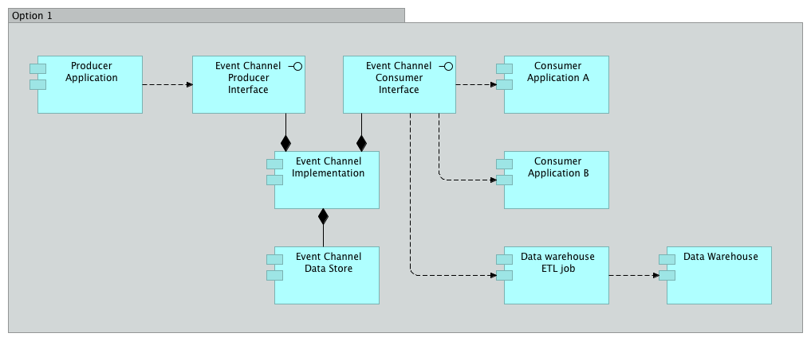
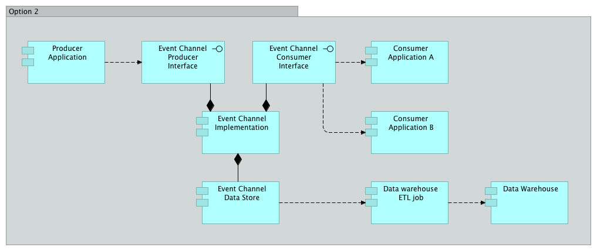

# Approach to Event-Driven Architecture

Early draft - not official

This is a first draft, and has not been reviewed or accepted by the Enterprise Architecture team. It is not yet official or recommended.

# Problem

You want to use event-driven architecture to produce event notifications in response to state change so that event consumers can react to events in a loosely coupled manner. You want to know how to deal with considerations like selecting the right message channel.

# Solution

Publish events from your application to an event channel so that consumers can integrate with your application in a loosely coupled manner to react to events that indicate state change for the data elements that your application is authoritative for.

In general, use the [Atom Publishing Protocol](https://tools.ietf.org/html/rfc5023) to publish events represented using the [Atom Syndication Format](https://tools.ietf.org/html/rfc4287) to an atom feed. Consume the atom entries from the atom feed.

In rare cases, it is appropriate to use a different message channel technology.

## Discussion

## Event-Driven Architecture
Event-Driven Architecture is an architectural pattern that is based on publishing event notifications in response to a change in state (i.e. an event), and reacting to those events in a loosely coupled manner.

### Fundamentals of event-driven architecture

#### Terminology
An event-driven architecture includes:

1. **Events** - A significant change in state. Events do not travel, they just happen. Note that 'event notifications' are often referred to simply as events as a form of shorthand, which can lead to confusion.
2. **Event notifications** - A message that is sent (typically asyncronously) to registered event consumers over an event channel to inform them of the event that happened.
3. **Event producers** - Publish event messages to event channels when the state of a resource changes. An event producer does not know about event consumers (i.e. whether they exist, how many there are, how events are or are not used by event consumers).
4. **Event consumers** - React to events. Event consumers do not know about one another.
5. **Event channels** - Conduits through which event notifications travel from event producers to event consumers. Examples include JMS topics, atom feeds, AWS Kinesis streams, etc.

#### Principles
Event-driven architecture is fundamentally different than request-driven service oriented architecture. Here are some of the fundamental aspects of this architectural style:

- Asynchronous “Push”-Based Messaging Pattern
Instead of the traditional “pull”-based synchronous request/response model
   - event-driven architecture implements the [Publish-Subscribe Channel](http://www.enterpriseintegrationpatterns.com/patterns/messaging/PublishSubscribeChannel.html) messaging pattern to “push” notifications out to interested listeners, in a “fire-and-forget” (does not block and wait for a synchronous response), uni-directional, asynchronous interaction.
- Autonomous Messages
   - Each message contains just enough information to describe a change in state such that event consumers can take appropriate action.
   - Each event notification stands on its own and does not require additional context such as in-memory session state of the event consumers.
- Higher decoupling of distributed systems      
   - Reduced contract coupling (see below for more discussion)
   - Event producers do not need to know about event consumers (see below for more discussion)             
   - Functional processes in the sender system, where the business event took place, do not depend on the availability and completion of remote processes in downstream distributed systems.
   - Unlike in a request-driven architecture, event producers do not depend on the availability and completion of remote functions in event consumer systems in order to successfully complete their own processing.
   - In synchronous request-driven architectures, connected systems are often required to meet the service-level requirements (i.e., availability and throughput) and scalability / elasticity of the system that has the highest transaction volume. But in asynchronous event-driven architectures, the SLA concerns of one system do not dictate the concerns of dependent systems, providing these teams with more design-time autonomy over things like infrastructure design.
   - This also means that changes to each connected system can be deployed more independently (and thus more frequently) with minimal impact to other systems, due to the overall reduced dependencies.

#### Benefits
Benefits of Event-Driven Architecture include:

1. Improves flexibility and reliability
   - Enables more resilient design, since event notifications are asyncronous, meaning that a failure in an event consumer does not affect the event producer's availability.
   - Event emitters don't need to know about their consumers so application dependencies are minimized. Changes to an event consumer do not affect an event producer.
   - Set of consumers can change over time without modifying event emitter. New consumers can be added, and existing consumers removed without affecting the event producer.
2. Allows an event producer to broadcast a single event to multiple event consumers.
3. Enables effective data integration
   - Event-driven architecture is inherently based on data about updates to business state. No central data coordination is required - interested consumers can simply subscribe to data feeds to obtain data updates they care about.
   - Ingestion of data into a data warehouse is simpler (see below for discussion).
4. Reduced information latency
   - Event notifications are delivered in near real-time.
   - Operational systems can have the most accurate, current view of the state of business.
5. Improved scalability
   - Asynchronous systems tend to be more scalable than synchronous systems.
6. Improved business agility
   - Allows different functional domains to interact while preserving a high degrees of local autonomy.
   - Business concepts and activities are modeled in simpler terms with responsibilities appropriately delegated to corresponding owners.
   - Reduced dependencies allow technical and functional changes to be planned and released more independently and frequently, achieving a higher level of IT agility and, hence, business agility.

### Event Processing Styles

An event-driven architecture includes at least one of these styles, or may include any combination of these styles:

1. *Simple event processing*: Concerns events that are directly related to specific, measurable changes of state. In simple event processing, a notable event happens which initiates downstream action(s). An example of a simple event is a new account being created.
2. *Event stream processing*: In event stream processing, notable event notifications are mixed in with ordinary event notifications in the event channel. Event consumers filter the event stream to identify and react to the notable events. An example of event stream processing is a temperature sensor in a data center hall. Most of the readings will be ordinary (i.e. within threshold), but some events will be notable (i.e. because they exceed threshold boundaries). This style allows the threshold business logic to live in the consumer rather than the producer.
3. *Complex event processing*: Allows a pattern of events to indicate that something has happened. The events (notable or ordinary) may cross event types and occur over a long period of time. The event correlation may be causal, temporal, or spatial. An example of complex event processing is identifying a security breach from a stream of events that, taken on their own may seem innocuous, but when considered as a whole, indicate a system compromise. This style allows complicated business logic to be implemented in a source that considers many inputs without needing to embed any business logic or dependencies within those individual input systems.

### Event Taxonomy
Event-driven architecture benefits from a clearly defined and standardized event taxonomy so that the events are meaningful and can be easily understood.

### Event notification contracts
As discussed above, event-driven architecture limits coupling between event producers and event consumers. This is desirable because it improves design-time autonomy for the owners of these systems, as well as run-time autonomy for the operators of the systems.

Other than the details of connecting to the event channel for sending and getting event notifications, this asynchronous message-based interaction model does not need to be as concerned with some aspects of request-response models such as input parameters, service interface definitions such as RAML, and fine-grained security.

One area in which coupling cannot be avoided is the representation of the event details in the event notification. We'll refer to this as the event notification contract.  

As explained in the [Rackspace SOA Guidelines](https://one.rackspace.com/download/attachments/49480223/RackspaceSOAGuidelines_v2.0_DRAFT1.pdf?version=1&modificationDate=1390945322000&api=v2), *Consumer-to-Contract* coupling is a desirable form of coupling that occurs when consumers use services through published, standardized contracts.

It is important that event producers publish a contract for the representation of event notifications that will appear on the event channel. This may be an XML schema or JSON schema, for example.

### Pipes and filters

Event-driven architecture permits event consumers to also be event producers (typically on a different event channel), which means that it is possible to chain together event processors as described by the [pipes and filters enterprise integration pattern](http://www.enterpriseintegrationpatterns.com/patterns/messaging/PipesAndFilters.html).

This may be useful for architects who wish to decompose a task that performs complex processing into a series of discrete elements that can be reused. This pattern can improve performance, scalability, and reusability by allowing task elements that perform the processing to be deployed and scaled independently.

### Event sourcing
Event-driven architecture enables the [Event Sourcing](http://martinfowler.com/eaaDev/EventSourcing.html) pattern. Event Sourcing ensures that all changes to application state are stored as a sequence of events. Not only can we query these events, we can also use the event log to reconstruct past states or to rebuild state to recover from a fault in the primary data store.

Event sourcing can also be combined with the [Command and Query Responsibility Segregation (CQRS) Pattern](http://martinfowler.com/bliki/CQRS.html) to address non-functional requirements like performance, scalability, security, and flexibility.

Event sourcing is a large topic, and we won't cover it in detail in this entry. The interested reader is referred to [Martin Fowler's Blog Post on the Event Sourcing Pattern](http://martinfowler.com/eaaDev/EventSourcing.html), and to the book [Implementing Domain Driven Design](https://www.amazon.com/Implementing-Domain-Driven-Design-Vaughn-Vernon/dp/0321834577) by Vaughn Vernon.

### Ingesting events into the data warehouse

Since event notifications have data that may be of interest for reporting purposes, especially when the event sourcing pattern is used (see above), we should consider how to get event notification data into the data warehouse.

One obvious way for this to happen is simply to create an ETL process within the data warehouse that acts as a consumer of event notifications on the appropriate event channel, and saves the event payload data into an appropriate data store.

Another possibility is to have an integration from the event channel to the data warehouse directly. In this scenario, the event notifications are published to the event channel by the event producer, and the event channel persists the event notification into a data store that the data warehouse is configured to integrate with.  This approach scales better as new event channels are added, since no additional ETL work is required by the data warehouse team. In fact, this is one of the primary considerations that leads us in a later section of this document to recommend Cloud Feeds as the preferred event channel.

### Selecting an appropriate event channel

In general, we prefer the use of [Cloud Feeds](https://support.rackspace.com/how-to/cloud-feeds-overview/) as an event channel. Reasons include:

1. Offers a RESTful interface, which conforms to our [Approach to (service-oriented) Integration](approach-to-integration.md).
2. Implements the [Atom Publishing Protocol](https://tools.ietf.org/html/rfc5023), a simple, widely used HTTP-based protocol for publishing web resources.
3. Represents event notifications using the [Atom Syndication Format](https://tools.ietf.org/html/rfc4287), a well-defined, widely used, extensible format for specifying the details about what is being published.
   - Many software libraries are already available for parsing atom entries (e.g. Apache Abdera).
4. Offers the ability for clients to publish or consume events in either XML or JSON, and adapts from one format to another transparently.
5. Optionally validates event notifications against a per-channel schema to ensure that producers only produce event notifications that conform to the published representation contract.
6. Widely used at Rackspace already
   - Once a team has created code to produce to or consume from a feed, it becomes very easy to repeat this on another project.
   - Code reuse is easy for producer and consumer software libraries in various languages
7. Customers may consume events from Cloud Feeds using an existing publicly available API.
8. By standardizing on this event channel, it is easier for the data warehouse to have only one place to gather event notifications from for reporting purposes. As described above, a single ETL job could pull in event notifications that span multiple event channels that are all realized by Cloud Feeds.
9. Along similar lines, business activity monitoring (BAM) and business event management (BEM) solutions can leverage the centrally available event data to offer business level metrics and monitoring.
10. Cloud Feeds is already well integrated with Rackspace security solutions like the Identity Service, Repose-based Role-Based-Access-Control (RBAC), etc.

When not to use Cloud Feeds:

1. When your integration requires faster delivery of events than is possible with Cloud Feeds.
   - At the time of this writing, the current implementation of Cloud Feeds includes a 10 second delay between event publication and the event becoming available for consumption due to an implementation detail.
   - HTTP, AtomPUB and Atom Syndication are less efficient for messaging than higher performance messaging technologies such as Apache Kafka, JMS, etc.
2. When your event producer does not have an internal IP address.
  - At the time of this writing the public interface Cloud Feeds is read-only. It does not offer a capability for event producers to publish event notifications from outside of our internal network.
3. When the payload size of your event notification exceeds the maximum size supported by Cloud Feeds.
4. When the volume of event notifications exceeds the maximum volume supported by Cloud Feeds.

Other considerations:

1. Cloud Feeds does not currently offer a capability for self-service feed creation. Currently creating a new feed requires developer / operational effort, which may extend your timeline for including a new feed in your application design.

# Good and Bad Practices

## Good Practices

1. Publish the event notification representation contract so that consumers can couple to this well-defined contract.

## Bad Practices

None

# Unresolved Issues

None

# Frequently Asked Questions

The following are frequently asked questions whose answers are worth collecting in one place.

*When should I use events, and when should I prefer synchronous API requests?*

Synchronous requests are appropriate when the event source (or client) depends on the receiver (or server) to perform and complete a function as a component of its own process execution.  This is most often found in the case of reuse of existing business logic / application function.

*How much data should be communicated via event notifications?*
*What should I include in my event notification payload?*
*How is this different from database replication?*

The purpose of an event notification is to inform event consumers about  changes in the state of a resource. Therefore, only data that is meaningful to the event that transpired should be included in the event notification payload.

A good rule of thumb is to include just enough data to help event receivers decide how to react to the event. If event consumers require more data or functional interaction to complete their processes they can use alternative integration interfaces such as synchronous REST API calls to accomplish that part of the interaction.

# References
1. [Atom Publishing Protocol](https://tools.ietf.org/html/rfc5023)
2. [Atom Syndication Format](https://tools.ietf.org/html/rfc4287)
3. [Pipes and Filters Enterprise Integration Pattern](http://www.enterpriseintegrationpatterns.com/patterns/messaging/PipesAndFilters.html)
4. Microsoft Developer Network - [Pipes and Filters Pattern](https://msdn.microsoft.com/en-us/library/dn568100.aspx)
5. [Event Sourcing](http://martinfowler.com/eaaDev/EventSourcing.html)
6. Vernon, Vaughn. [Implementing Domain Driven Design](https://www.amazon.com/Implementing-Domain-Driven-Design-Vaughn-Vernon/dp/0321834577)
7. [Command and Query Responsibility Segregation (CQRS) Pattern](http://martinfowler.com/bliki/CQRS.html)
8. Microsoft Developer Network - [Command and Query Responsibility Segregation (CQRS) Pattern](http://martinfowler.com/bliki/CQRS.html)https://msdn.microsoft.com/en-us/library/dn568103.aspx)
9. Mircosoft Developer Network. The Architecture Journal. [Using Events in Highly Distributed Architectures](https://msdn.microsoft.com/en-us/library/dd129913.aspx)

# Contributors

Ben Truitt
