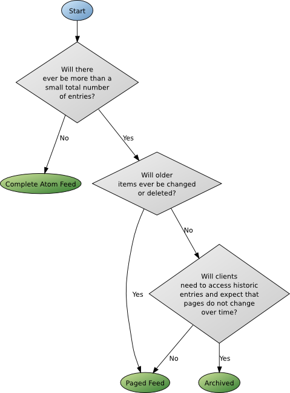
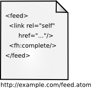
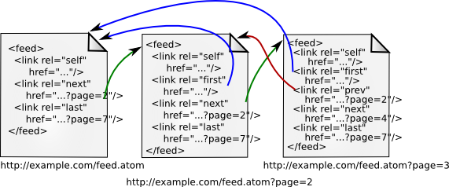
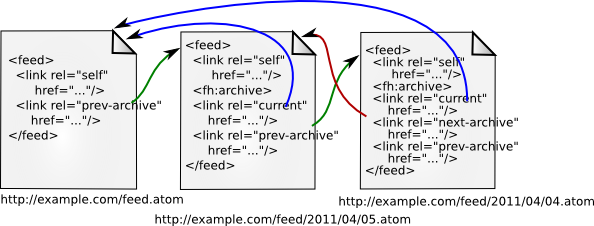

# Atom Feed Paging and Archiving

# Problem

The number of entries in an Atom Feed exceed the reasonable number of elements that you'd like to include in a single response.

# Solution

Select one of the standard Atom paging styles defined in [RFC 5005: Feed Paging and Archiving](http://www.ietf.org/rfc/rfc5005.txt).

# Discussion

Atom provides a good means exposing events and list of data entities. It gives clients a standard well-understood way to consume that stream of data and provides systems with a resource efficient way of producing that data.

For many of the Feeds that we will produce, the number of entries that will be produced exceeds the number of entries that are optimal to include in a single feed. This document will describe the three styles of Atom Feeds (with regards to paging) and provide selection criteria to determine which style to choose for a particular application. In addition, this document will provide some guidance as to how to best produce the feeds in a resource efficient manner.

## Choosing a Feed Paging Style

The following chart and table provide some guidance on choosing the correct paging style for your feed.



## Paging Style Criteria

Paging Style | Large Number of Items in Logical Feed | Older Items May Change or Be Deleted | Clients Must Reconstruct Logical Feed at a particular point in time | Feed Pages Should Not Change
-------------|---------------------------------------|--------------------------------------------|-----------------------------------------------------------------------|-----------------------------
Complete |   | X |   |   |
Paged    | X | X |   |   |
Archived | X |   | X | X |

## Atom Feed Paging Structure

### Complete Feeds



Complete feeds are not paged. The full content of the feed is contained in a single document.

### Paged Feeds



Paged Feeds consist of one or more documents with hyperlinks interconnecting the page documents.

### Archive Feeds



Like paged feeds, Archive Feeds are collections of one or more documents that are interconnected via hyperlinks. Unlike paged feeds, archive feeds are intended for long term persistence and other than the *current* document with the latest items, archived feed pages are static. See details below for more information.

## Details

### Complete Feeds

Complete Atom Feeds contain the contents of the full Logical Feed (all entities represented by the feed). This sort of feed is the easiest to implement but does not provide support for paging of any sort.

This sort of feed is still valuable is certain situations where the number of feed entries that will ever exist will remain small.

The following example illustrates a sample Complete Atom Feed:

*Complete Atom Feed*

```xml
<?xml version="1.0" encoding="utf-8"?>
<feed xmlns="http://www.w3.org/2005/Atom" xmlns:fh="http://purl.org/syndication/history/1.0">
  <title>NetMovies Queue</title>
  <subtitle>The DVDs you'll receive next.</subtitle>
  <link href="http://example.org/"/>
  <fh:complete/>
  <link rel="self" href="http://netmovies.example.org/jdoe/queue/index.atom"/>
  <updated>2003-12-13T18:30:02Z</updated>
  <author>
    <name>John Doe</name>
  </author>
  <id>urn:uuid:60a76c80-d399-11d9-b93C-0003939e0af6</id>
  <entry>
    <title>Casablanca</title>
    <link href="http://netmovies.example.org/movies/Casablanca"/>
    <id>urn:uuid:1225c695-cfb8-4ebb-aaaa-80da344efa6a</id>
    <updated>2003-12-13T18:30:02Z</updated>
    <summary>Here's looking at you, kid...</summary>
  </entry>
</feed>
```

Notice above, the `<fh:complete/>` element which designates that this feed is a Complete Atom Feed. The element is defined in the namespace `http://purl.org/syndication/history/1.0`.

## Paged Feeds

Paged feeds provide a set of entries at the root of the Atom Feed Url with links as a child of the `<feed>` element which point to the next and/or previous pages of entries.

The Feed Paging and Archiving spec does not specify a naming convention for following pages, but it does suggest using a query parameter named "`page`" in the examples it provides.

As opposed to usual web application practice, the spec does not suggest using a parameter to specify the number of returned entries. In practice it is a good idea to not provide this level of customization because it makes practical caching impossible.

Following is an example of a Paged Atom Feed:

*Paged Atom Feed*

```xml
<?xml version="1.0" encoding="utf-8"?>
<feed xmlns="http://www.w3.org/2005/Atom">
  <title>Example Feed</title><link href="http://example.org/"/>
  <link rel="self" href="http://example.org/index.atom?page=3"/>
  <link rel="first" href="http://example.org/index.atom"/>
  <link rel="next" href="http://example.org/index.atom?page=2"/>
  <link rel="previous" href="http://example.org/index.atom?page=4"/>
  <link rel="last" href="http://example.org/index.atom?page=7"/>
  <updated>2003-12-13T18:30:02Z</updated>
  <author>
    <name>John Doe</name>
  </author>
  <id>urn:uuid:60a76c80-d399-11d9-b93C-0003939e0af6</id>
  <entry>
    <title>Atom-Powered Robots Run Amok</title>
    <link href="http://example.org/2003/12/13/atom03"/>
    <id>urn:uuid:1225c695-cfb8-4ebb-aaaa-80da344efa6a</id>
    <updated>2003-12-13T18:30:02Z</updated>
    <summary>Some text.</summary>
  </entry>
</feed>
```

In example above, the highlighted link with rel "next" is an example of the kind of link required to link paged atom feed documents. In a Paged Atom Feed, the following link relationships should be included (when appropriate).

### Paged Atom Feed Link Relationships

| Name | Description |
|------|-------------|
| first | A URI that refers to the furthest preceding document in a series of documents.|
| last  | A URI that refers to the furthest following document in a series of documents.|
| previous | A URI that refers to the immediately preceding document in a series of documents.|
| next | A URI that refers to the immediately following document in a series of documents.|

## Archived Feeds

Archived Atom Feeds provide a solution for the need to establish the state of the Logical Feed at an arbitrary point in the past. For feeds such as event feeds, it permits a client to "catch up" with events they may have missed and page in a predictable and constant style. It also provides the best ability for a service to cache feed archive pages.

Archived Feeds differ from paged feeds in a couple of important ways:

* Archive Pages are static and may not change.
* Links between archive pages have one of the relationships below.

### Archived Atom Feed Link Relationships

|Name          | Description |
|--------------|-------------|
| prev-archive | A URI that refers to the immediately preceding archive document. |
| next-archive | A URI that refers to the immediately following archive document. |
| current      | A URI that, when dereferenced, returns a feed document containing the most recent entries in the feed. |

An Archived Atom Feed contains two document styles: a subscription document which contains the latest entries and one or more archive documents for earlier entries.

An example of an subscription (current) feed:

*Subsciption (Current) Feed*

```xml
<?xml version="1.0" encoding="utf-8"?>
<feed xmlns="http://www.w3.org/2005/Atom">
  <title>Example Feed</title>
  <link href="http://example.org/"/>
  <link rel="self" href="http://example.org/index.atom"/>
  <link rel="prev-archive" href="http://example.org/2003/11/index.atom"/>
  <updated>2003-12-13T18:30:02Z</updated>
  <author>
    <name>John Doe</name>
  </author>
  <id>urn:uuid:60a76c80-d399-11d9-b93C-0003939e0af6</id>
  <entry>
    <title>Atom-Powered Robots Run Amok</title>
    <link href="http://example.org/2003/12/13/atom03"/>
    <id>urn:uuid:1225c695-cfb8-4ebb-aaaa-80da344efa6a</id>
    <updated>2003-12-13T18:30:02Z</updated>
    <summary>Some text.</summary>
  </entry>
</feed>
```

An example of an archived feed:

*Archived Feed*

```xml
<?xml version="1.0" encoding="utf-8"?>
<feed xmlns="http://www.w3.org/2005/Atom" xmlns:fh="http://purl.org/syndication/history/1.0">
  <title>Example Feed</title>
  <link rel="current" href="http://example.org/index.atom"/>
  <link rel="self" href="http://example.org/2003/11/index.atom"/>
  <fh:archive/>
  <link rel="prev-archive" href="http://example.org/2003/10/index.atom"/>
  <updated>2003-11-24T12:00:00Z</updated>
  <author>
    <name>John Doe</name>
  </author>
  <id>urn:uuid:60a76c80-d399-11d9-b93C-0003939e0af6</id>
  <entry>
    <title>Atom-Powered Robots Scheduled To Run Amok</title>
    <link href="http://example.org/2003/11/24/robots\_coming"/>
    <id>urn:uuid:cdef5c6d5-gff8-4ebb-assa-80dwe44efkjo</id>
    <updated>2003-11-24T12:00:00Z</updated>
    <summary>Some text from an old, different entry.</summary>
  </entry>
</feed>
```

# Good and Bad Practices

## Good Practices

1.  Ensure the appropriate `purl` element is included in your feed.
2.  Validate your Atom Feed with the RelaxNG schema.
3.  Though your Feed URIs should be opaque from a RESTful SOA guidelines perspective, it can be valuable (when practical) to choose an archiving URI scheme which is meaningful for human clients. See "About Feed URI Schemes for readability" below.
4.  Think about the best number of entries to contain on a single feed page. If the number isn't predictable for a particular time slice, consider splitting pages based on the number of latest entries in the feed. For example: produce a new page every 500 entries.

*About Feed URI Schemes for readability*

The server should structure archive URIs with a logical, human friendly structure to facilitate understanding and serendipity, but client code should rely only on selection of server-provided links using atom link relations described here.

Mike Nerone and Lisa Clark suggested a design pattern in which the service accepts a URI path containing a date and responds with a redirect to the an Archive Page URI which contains entries for that date.

For example:

`http://change.api.rackspace.com/events/change-requests/archives/2011/04/01`

Would return a 301 to the real archive URI which contains the requested time:

`http://change.api.rackspace.com/events/change-requests/archives/abc123`

## Bad Practices

1.  Extend the Atom Feed pagination scheme in ways unique to your application.
2.  Permit client selection of the number of entries per feed page (this hurts cacheability).
3.  Change the content of archived pages. This is explicitly forbidden by the spec.

# Unresolved Issues

1.  This cookbook does not resolve the problem of archived feeds where a client desires url addressability by date but some dates contain an unmanageable number of entries.

# Frequently Asked Questions

The following are frequently asked questions whose answers are worth collecting in one place.

1. *My Atom Feed usually produces entries at a particular rate, but occasionally can be flooded with more entries. How can I decide when to create a new archive page?*

    Answer: For Atom Feeds with a large variance in number of entries over time, the best practice is to split pages at a fixed number of entries.

2. *Ok - I see `<fh:complete>` and `<fh:archived>`. Where is the `<fh:paged>` element?*

    Answer: The spec doesn't refer to one. I suspect this indicates a subtle bias towards using paged style feeds as a default.

# References

1.  [Feed Paging and Archiving](http://www.ietf.org/rfc/rfc5005.txt), IETF RFC 5005

# Contributors

* Mark Morga
* Bryan Taylor
