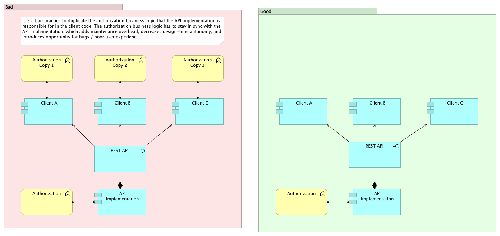
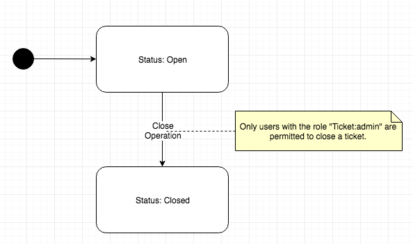
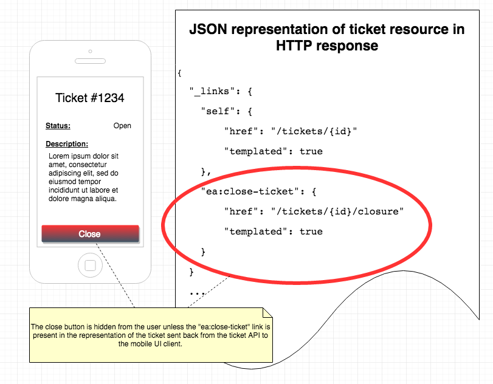

# Conditionally enabling user interface controls based on business rules in an API

Early draft - not official

This is a first draft, and has not been reviewed or accepted by the Enterprise Architecture team. It is not yet official or recommended.

# Problem

You want to know how your user interface can conditionally enable user interface controls depending on access control business logic found in a service you depend on.

# Solution

Use the presence or absence of HATEOAS links returned by an API to conditionally show / hide or enable / disable user interface controls.

## Discussion

So you've got a RESTful API that follows the [HATEOAS cookbook](how-to-implement-hateoas.md)'s good practices by explicitly providing hyperlinks for every application state transition relevant to the client.

Your user interface needs to present controls to your users to perform actions that result in calling the API to accomplish application state transition.

It'd be best to avoid duplicating business logic related to deciding whether a user can perform a given action.  This business logic already has to be implemented in the service since yours may not be the only client of the API.

It is a bad practice to duplicate the authorization business logic that the API implementation is responsible for in the client code. The authorization business logic has to stay in sync with the API implementation, which adds maintenance overhead, decreases design-time autonomy, and introduces opportunity for bugs / poor user experience.

To avoid duplicating this business logic, and to avoid a need for out-of-band communication between the service implementor and your user interface team, you can simply leverage the HATEOAS links provided by the API to decide which user interface controls to enable.

In the representation for a given resource, an API that follows the [HATEOAS cookbook](how-to-implement-hateoas.md)'s good practices will return hyperlinks for every application state transition that the client is permitted to initiate.  Therefore, you can use the presence or absence of a given hyperlink in the representation to conditionally enable or disable the related user interface control.

The implication is that the origin service (or an HTTP intermediary that is within its service boundary) must conditionally include / exclude HATEOAS links.  It should do this:

1. Based on permissions such as role-based-access-control, only including a HATEOAS link in the response when the requestor has sufficient permissions to invoke the related capability.
2. (optionally) based on resource state. For example, consider a resource with a lifecycle such as pre-approval and post-approval. Once in the post-approval state, it cannot be approved again. Therefore, the response for a resource in the post-approval state should exclude a HATEOAS link to the 'approve' capability.

### Examples

Consider the example of a ticketing API that includes a resource named `/tickets/{id}`. For the sake of discussion, let's assume a very simple lifecycle for this resource:

Let's assume that the ticketing API exposes a capability to close an open ticket, which can be invoked with a `PUT` request to the `/tickets/{id}/closure` URI of this RESTful API.

Let's consider what we want in the ticket representation that is returned by the API in response to a `GET` request to the `/tickets/{id}` resource:

| Ticket State (open / closed) | Authenticated client has "Ticket:admin" role? | Include HATEOAS link to `/tickets/{id}/closure` resource in response?|
|:------:|:---:|:---:|
| Open   | Yes | Yes |
| Closed | Yes | No  |
| Open   | No  | No  |
| Closed | No  | No  |

This business logic would be implemented by the origin service (i.e. the API implementation), or by an HTTP intermediary such as Repose that is within the service boundary of the API, or a combination thereof (see FAQ below for more on this topic).

In our example, lets assume that we have a mobile app that consumes the ticketing API to allow users to view and administer tickets. We want the user experience to reflect the table above: if the user doesn't have permission to close the ticket, or the ticket is already closed, then we don't want to show a 'Close Ticket' UI element. On the other hand, users with the correct role should see such an UI element for open tickets in the mobile UI.

# Good and Bad Practices

## Good Practices

1.  Conditionally enable user interface controls based on the presence of the relevant HATEOAS hyperlink in the resource's representation returned from the API.

## Bad Practices

1.  Duplicate authorization business logic that is the responsibility of the API implementation.

2.  Display user controls for every user, even though some users may not have permission from the API implementation to initiate the corresponding state transition.

# Unresolved Issues

None

# Frequently Asked Questions

The following are frequently asked questions whose answers are worth collecting in one place.

*As a service provider, how can I use an HTTP intermediary to implement the authorization-conditioned business logic?*

Authorization business logic can be implemented in the origin service, in an HTTP intermediary within the API service boundary, or both.

| Business Logic Concern | Appropriate for Origin Service? | Appropriate for HTTP intermediary?|
|:--------------------------:|:---:|:---:|
| Coarse-grained permissions | Yes1 | Yes |
| Fine-grained permissions   | Yes | Yes2  |
| Contextual business logic  | Yes  | No3  |

Notes on the table:

1. In cases where you are using an HTTP intermediary such as Repose to implement coarse-grained permissions (e.g. RBAC), it is preferable to implement this concern in the intermediary as well, since it keeps the coarse-grained permission business logic cohesive and encapsulated within one place for easier maintenance and testing. However, this requires the HTTP intermediary to inspect and modify the response body to remove the HATEOAS link for responses to clients with insufficient permission. You'll need to be sure your HTTP intermediary supports this functionality.
2. The same logic from the previous point applies for fine-grained permissions, but this will only make sense to do when your HTTP intermediary is concerned with fine-grained permissions.
3. The HTTP intermediary is not a good place to implement contextual business logic such as logic based on resource state, since this spreads out the business logic of your API implementation and increases maintenance burden.

*Instead of using HATEOAS links, what about HTTP OPTIONS verb?*

The HTTP OPTIONS verb is another way to solve the problem statement in this cookbook entry. However, we prefer the HATEOAS link approach because:

1. It is aligned to "Hypermedia as the engine of application state (HATEOAS)" constraint, an aspect of the "Uniform Interface" constraint of the RESTful architectural style.

# References

1. [Hypermedia as the Engine of Application State (HATEOAS)](how-to-implement-hateoas.md)
2. [Hypertext as the Engine of Application State (HATEOAS) in JSON](../representation-design/json-hateoas-links.md)
3. [Repose HTTP Intermediary](http://www.openrepose.org/)

# Contributors

- Ben Truitt
- Hector Munoz
- Mark Morga
- Josh Schairbaum
