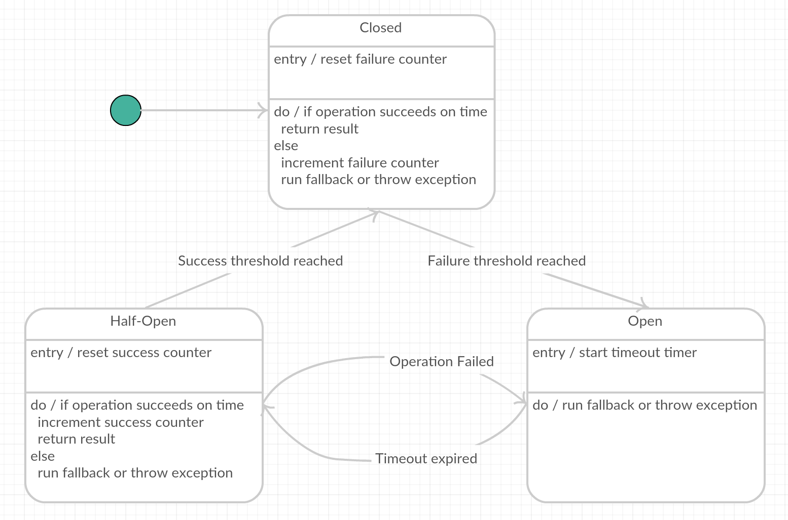

# Publishing Events to an Event Channel

# Problem

You want to keep your application online and serving traffic at all times Therefore you want to know how to design your application to be resilient to failures that may happen in the dependencies of your application.

# Solution

Use the circuit breaker pattern to detect failure of a dependency and to automatically take corrective action such that your application remains highly available.

## Discussion

Failure is a fact of life in software systems. Nearly every software application of interest will depend upon other systems. These may be databases, message queues, APIs, etc.  These other applications are frequently deployed on different hosts across a network.  The dependencies can fail, or can become unacceptably slow. Left unattended, this can cause your own application to become slow or unresponsive.

Even an dependency with 99.99% uptime [will be unavailable](https://en.wikipedia.org/wiki/High_availability#Percentage_calculation) for over 1 minute every week, on average.  

Applications with multiple dependencies have multiple opportunities for failure. If an application has 5 dependencies, each of which has 99% availability, and if all of these must be available for the application to itself be available, then the availability of this composite application will be `99% * 99% * 99% * 99% * 99% = 95%`. So even though each dependency is only down for an average of 1.68 hours per week, the composite application will be down for 8.4 hours per week, on average.

Failures can also quickly cascade through a complex software system, starting with just a single failure, but dominoing out into a series of failures affecting a larger swath of the system. A circuit breaker is used to provide stability and prevent cascading failures in distributed systems.

Since these failure windows are typically short-lived and unpredictable, manual detection and mitigation is impractical.

Therefore, it is important to be able to automatically detect and mitigate failure or slowness in a dependency so that your own application remains highly available.

### Principles of Resiliency

From the [Netflix tech blog on this same topic](http://techblog.netflix.com/2011/12/making-netflix-api-more-resilient.html), here are some principles of designing applications for resiliency:

1.  A failure in a service dependency should not break the user experience
2.  The application should automatically take corrective action when one of its dependencies fails
3.  The application should be able to show us what’s happening right now, in addition to what was happening 15-30 minutes ago, yesterday, last week, etc.

### The circuit breaker pattern

Just like the electrical device that it takes its name from, the circuit breaker pattern protects access to an underlying resource - in this case a protected software function.  

This is achieved by wrapping the protected function in a circuit breaker object that is responsible for monitoring the function for failures. Once the failures reach some pre-defined threshold, the circuit breaker trips, and all further calls to the circuit breaker return with an error, without the protected resource being invoked at all. Typically this condition triggers a monitoring alert as well.

This pattern comes from Michael Nygard’s book "[Release It! Design and Deploy Production-Ready Software](https://www.amazon.com/Release-Production-Ready-Software-Pragmatic-Programmers/dp/0978739213?ie=UTF8&*Version*=1&*entries*=0)".  Netflix has popularized some extensions to this pattern which should be considered best practices. These extensions are additional triggers and fallbacks, which we'll now discuss.

#### Triggers

These triggers all increment the service's overall error rate and when the error rate exceeds a defined threshold per unit time then we "trip" the circuit for that service and immediately serve fallbacks without even attempting to communicate with the remote service:

1.  The remote service dependency is **unavailable**
2.  A request to the remote service **times out**
3.  The **thread pool** and bounded **task queue** used to interact with a service dependency are **at 100% capacity**
4.  The **client library** used to interact with a service dependency **throws an exception**

It is also possible to have more complex configurations for how these triggers are evaluated. You might configure your application with different thresholds for different errors, such as a threshold of 10 for timeouts but 3 for connection failures.

#### Fallback Strategies

Circuit breakers on their own are valuable, but developers using them need to instruct their applications to react to tripped breakers.  Does a tripped breaker fail the operation you're carrying out, or are there workarounds you can do? For example, a long running transaction could be put on a queue to deal with later; failure to get some data may be mitigated by showing some stale data that's good enough to display.

Each service that’s wrapped by a circuit breaker implements a fallback using one of the following three approaches:

1.  **Custom fallback** - in some cases a service’s client library provides a fallback method we can invoke, or in other cases we can use locally available data on an API server (e.g., a cookie or local JVM cache) to generate a fallback response
2.  **Fail silent** - in this case the fallback method simply returns a null value, which is useful if the data provided by the service being invoked is optional for the response that will be sent back to the requesting client
3.  **Fail fast** - used in cases where the data is required or there’s no good fallback. For APIs, this fallback strategy results in a client getting a 5xx response. As the 5xx error propagates back to the end user, this can negatively impact the user experience, but it keeps API servers healthy and allows the system to recover quickly when the failing dependency becomes available again.

Ideally, all service dependencies would have custom fallbacks as they provide the best possible user experience (given the circumstances). Although that should be the goal, it’s also very challenging to maintain complete fallback coverage for many service dependencies. So the fail silent and fail fast approaches are reasonable alternatives.

#### Sync vs Async

When your application is servicing many concurrent requests, it is possible to be in a condition in which many calls are just waiting for the dependency timeout to be reached. Since remote calls are often slow, it is a good idea to put each call on a different thread using a future or promise to handle the results when they come back. By drawing these threads from a thread pool, you can arrange for the circuit to break when the thread pool is exhausted.

Another common technique used for asynchronous interactions with dependencies is to put all requests on a queue, configuring the circuit to open when the queue fills up.

#### Recovering / closing the circuit breaker

With electrical circuit breakers in buildings, the breaker continues to remain open, protecting the underlying resource, until an external (i.e. manual) intervention resets it when things are well again.

For software circuit breakers we can have the breaker itself detect if the underlying calls are working again. We can implement this self-resetting behavior by trying the protected call again after a suitable interval, and resetting the breaker should it succeed.

The circuit breaker proxy object can be implemented as a state machine as pictured above. The states depicted are:

* **Closed**: The request from the application is routed through to the underling application function. The proxy maintains a count or percentage of the number of recent failures, and if the call to the application function is unsuccessful or the call exceeds the timeout interval, the proxy increments this failure count / percentage. If the number of recent failures exceeds a specified threshold within a given time period, the breaker transitions to the Open state.
* **Open**: The request from the application is _not_ passed to the underlying application function. Instead, if a fallback function is specified, that function is invoked. Otherwise, an exception is thrown to the client code. When the circuit breaker proxy object enters this application state, the object starts a timeout timer, and when this timer expires the proxy is placed into the Half-Open state. The purpose of the timeout timer is to give the system time to rectify the problem that caused the failure before allowing the application to attempt to perform the operation again.
* **Half-Open**: A limited number of requests from the application are allowed to pass through and invoke the operation. If these requests are successful, it is assumed that the fault that was previously causing the failure has been fixed and the circuit breaker switches to the Closed state (the failure counter is reset). If any request fails, the circuit breaker assumes that the fault is still present so it reverts back to the Open state and restarts the timeout timer to give the system a further period of time to recover from the failure. The Half-Open state is useful to prevent a recovering service from suddenly being inundated with requests. As a service recovers, it may be able to support a limited volume of requests until the recovery is complete, but while recovery is in progress a flood of work may cause the service to time out or fail again.

#### Monitoring and operations

Circuit breakers are a natural place for instrumenting your application with monitoring functionality. Any change in breaker state should be logged and/or should trigger an alert. Breaker state should be exposed via monitoring / dashboards. Breaker behavior is often a good source of warnings about deeper troubles in the environment.

Additionally, breakers are a natural place to empower operations personnel to exert run-time control over the behavior of the application. This may include manually opening or manually closing a breaker or perhaps even changing breaker thresholds at run time.

### Circuit Breakers at different layers of the application stack

Circuit breakers can appear at different layers of an application stack. The following subsections give suggestions on the unique challenges for dealing with circuit breakers in each of these layers.

#### Circuit breakers in the client-side user interface

Circuit breakers can be used in client-side javascript code in the browser.

While a client-side circuit breaker should help reduce load on  backend servers in the event of system failures, it is not a replacement for server side circuit breakers or other high-availability design approaches.

Client side circuit breakers reduce demand for for failing backend application functions, which should provide necessary "breathing room" for the back-end systems to recover from the failure condition.

Client-side circuit breakers also enable a graceful degradation of the user experience in the browser.

However, these client-side circuit breakers are necessarily per-user, so as new users begin to try to make use of your application, their browsers will not initially be aware of the failure condition and will each independently "discover" this by tripping their individual browser-based circuit breakers.

#### Circuit breakers in the user interface back-end application

For applications that have both a client-side component (e.g. AngularJS component) and a server-side component (e.g. a Java, Python or similar backend application offering an application interface consumed by the client-side code), the server-side application can implement the circuit breaker pattern for its dependencies.

This might be something that makes sense when the back-end application is acting as a proxy into your internal application interfaces that aren't exposed publicly (and hence aren't available to the client-side code directly), or when your back-end is doing some adaptation or gateway function to these dependencies.

Unlike with client-side circuit breakers, the server-side breaker's state can be shared across different users.  This means that the circuit can trip faster during concurrent use than occurs for individual clients, since the threshold for tripping the circuit will be reached more quickly due to the cumulative failure across the user base.  

It also means that there is just one circuit that needs to recover in order for the entire user base served by that application instance to have service restored for the problematic dependency.

#### Circuit breakers in all other application components

Now that we've moved "deeper" into the dependency chain (beyond the user-facing application components) to middle-tier components such as composite APIs, entity services, etc., the circuit breaker advice becomes very simple - just follow the triggers and fallback advice found above.

# Good and Bad Practices

## Good Practices

1.  Rather than invent your own circuit breaker solution, use a circuit breaker library like one of the ones listed in the FAQ section below.
2.  When considering the tradeoff between an aggressive threshold (i.e. an easily tripped circuit that is very sensitive to failure) vs. a more tolerant threshold value, prefer the aggressive circuit breaker so that underlying resources are protected from being overwhelmed and so that the user experience is protected from the effects of failure.
3.  Use circuit breakers in more than one layer of the application stack.  Each application component in the architecture should protect itself from failure in its dependencies. Don't rely on your dependency to deal with failure further down the stack.
4.  Connect the circuit breaker to your monitoring / alerting system.
5.  Enable DevOps to manually trip or manually reset breakers
6.  Introduce logging-only circuit breakers at first. You’ll want to review and tweak their parameters before affecting production traffic.
7.  Expect to run into surprises. In particular with internal APIs, where availability might not be as well defined or understood, you might see breakers changing state often.
8.  Consider sharing breaker failure monitoring results / alerts with the operational teams that support your dependencies. This is a great way to give them automated feedback about the availability of the systems these teams maintain that they may otherwise be missing. However, this advice may be counter to goals for team autonomy, so consider this only to be a suggestion to think about.  
9.  Time out early / fail fast. Services operating slowly are often more damaging than services failing fast.
10.  Use the circuit breaker pattern in conjunction with other patterns such as the retry pattern.

## Bad Practices

1.  Don't use integer values of error count for the threshold of the circuit breaker, rather use a percentage. While simpler,  breakers based only on count don’t scale well in production: make 10x more calls, and your circuits will open 10x more often. Avoid this by specifying the threshold as a percentage.
2.  Don't design your system to require manual intervention to close an open (tripped) circuit breaker. Instead, use automated retry (see above) to automatically restore service once the dependent system is functioning properly.
3.  Don't confuse failure of one component with potential failure of another. For example, in a data store that comprises multiple shards, one shard may be fully accessible while another is experiencing a temporary issue. An application that treats these independent components as a single point of failure may not attempt to access the working component even when it is possible to do so.

# Unresolved Issues

None

# Frequently Asked Questions

The following are frequently asked questions whose answers are worth collecting in one place.

*What libraries can I use to make use of circuit breakers in my own code?*

| Language / Framework    | Libraries               |
|-------------------------|-------------------------|
|Javascript / AngularJS   | [ng-http-circuitbreaker](https://github.com/mikepugh/ng-http-circuitbreaker)|
|Java | [Netflix Hystrix](https://github.com/Netflix/Hystrix) |
|Java / Akka | [Akka Circuit Breaker](http://doc.akka.io/docs/akka/snapshot/common/circuitbreaker.html) |
|Java / Spring | [Spring Breaker](https://developmentsprint.github.io/spring-breaker/site/0.0.1/documentation.html) |
|Java / Spring | [Spring Cloud](http://projects.spring.io/spring-cloud/) |
|Python| [pybreaker](https://pypi.python.org/pypi/pybreaker/0.2.2) |
|Ruby| [circuit_breaker](https://github.com/wsargent/circuit_breaker)|
|Ruby|[Stoplight](https://github.com/orgsync/stoplight/blob/v1.0.0/README.md#readme)
|Go|[circuitbreaker](https://github.com/rubyist/circuitbreaker)|
|Go|[GoHystrix](https://github.com/dahernan/goHystrix)|

# References

1. [Release It! Design and Deploy Production-Ready Software](https://www.amazon.com/Release-Production-Ready-Software-Pragmatic-Programmers/dp/0978739213?ie=UTF8&*Version*=1&*entries*=0)
2. [Martin Fowler's blog entry on the Circuit Breaker pattern](http://martinfowler.com/bliki/CircuitBreaker.html).
3. [Making Netflix API More Resilient](http://techblog.netflix.com/2011/12/making-netflix-api-more-resilient.html). Netflix Tech Blog.
4.  [Heroku blog entry on circuit breakers](https://engineering.heroku.com/blogs/2015-06-30-improved-production-stability-with-circuit-breakers/)
5.  [Microsoft Developer Network's documentation on the Circuit Breaker Pattern](https://msdn.microsoft.com/en-us/library/dn589784.aspx)

# Contributors

Ben Truitt
