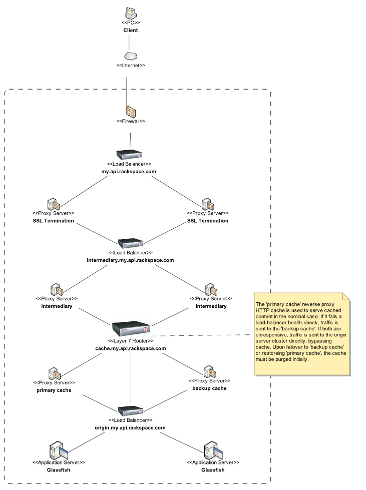

# Using HTTP Proxy Caching

# Problem

You want to know how use HTTP proxy caching in your RESTful service.

# Solution

Use a layered approach in your service deployment, where each layer fulfills a specific function and can be scaled independently of the other layers.

Use [Varnish Cache](https://www.varnish-cache.org) as your HTTP reverse proxy cache. Deploy Varnish Cache to one primary server and one or more backup servers for fail-over. Configure your load balancer to direct traffic to the primary Varnish Cache server in the nominal case. In the event the primary server fails a load balancer health check, direct traffic to a standby Varnish Cache server. If the backup server also becomes unresponsive, direct traffic directly to the origin server cluster, bypassing the cache. When failing over to a standby Varnish Cache server, or when restoring the primary Varnish Cache server, purge all entries from the cache to maintain consistency between the cache and the underlying origin server.

Configure the primary and backup Varnish Cache servers to invalidate cache entries when a mutating request is accepted (i.e. PUT, POST or DELETE). By default, Varnish does not perform this functionality, but it is required by [RFC 2616](http://www.w3.org/Protocols/rfc2616/rfc2616-sec13.html#sec13).

# Discussion

Varnish Cache does not support cache clustering protocols such as ICP, HTCP or Cache Digests. Therefore, the solution presented here uses only one active Varnish Cache server at a time. This keeps the architecture of the solution relatively simple, while ensuring that the cached content remains consistent with the state of the resources served by the origin server(s).

Using a single active Varnish Cache server at a time has the potential to limit scalability of the HTTP caching layer in this solution. However, from a practical point of view, a single Varnish Cache server that is properly configured and running on modern 64-bit hardware and operating system should be able to handle a tremendous amount of traffic before becoming a bottleneck. In the unlikely event that the solution presented here cannot scale to meet the needs of your service, you might consider one of the alternative approaches to deploying Varnish Cache found in this presentation on [HTTP Proxy Caching Options](https://confluence.core.rackspace.com/download/attachments/19171772/HTTP_Proxy_Caching_Options.pdf).

When failing over to a backup, or restoring traffic to a primary Varnish Cache server, it is important to purge all items from the cache before allowing it to serve traffic. Doing so prevents previously cached content that has since become invalid from being served to clients.

# Good and Bad Practices

## Good Practices

1.  Configure Varnish Cache to invalidate a cache entry when a mutating operation (PUT, POST or DELETE) is accepted.
2.  Use the Standard Topology.

## Bad Practices

1.  Do not use more than one active Varnish Cache server at a time in your solution unless you take specific steps to ensure that the cached content remains consistent with the state of the underlying data. Instead, use only one active Varnish Cache server at a time, or follow one of the alternative solutions found in this presentation on [HTTP Proxy Caching Options](https://confluence.core.rackspace.com/download/attachments/19171772/HTTP_Proxy_Caching_Options.pdf)
2.  Using something non-standard topology for proxy caching.

Standard Deployment Topology

. In this topology, Varnish is fully dealt with in terms of configuration / deployment etc.

# Frequently Asked Questions

The following are frequently asked questions whose answers are worth collecting in one place.

*How do I know whether my service needs to include a reverse proxy cache? What metrics can I use to know whether it provides an improvement?*

An HTTP proxy cache will only benefit your service if you follow the [Using HTTP Headers for Expiration Caching](using-http-headers-for-expiration-caching.md) and/or [Supporting HTTP Cache Validation](supporting-http-cache-validation.md) cookbook entries. If your service does not support the HTTP headers relevant to caching, it will not benefit from an HTTP proxy cache.

Use performance profiling techniques to identify performance bottlenecks in your service deployment. If profiling reveals that processing a request on the application server is costly from a performance perspective, start by trying to optimize the code in question, and consider employing other caching techniques such as [Using Database Caching](using-database-caching.md).

If these optimizations do not improve performance to the extent desired, and if the resources in question are cacheable, then it is likely that introducing an HTTP proxy cache will improve performance.

*I want to achieve high availability for my service. I plan to deploy the service in two separate data centers for geographic redundancy. I plan to use an Active / Passive approach so that the second instance of my service only serves traffic when the primary instance is unavailable. What considerations should I make for the reverse proxy cache?*

Use the solution described above. Duplicate the deployment topology in each data center. Do not configure the two clusters to know about one another in any way.

Prevent both clusters from serving traffic at the same time in order to avoid the risk that data will become out of sync between the caches found in the two clusters. When failing over to the standby cluster, or when restoring service to the primary cluster, purge the caches in the cluster that will become active before it begins to serve traffic.

Do not concern yourself with keeping the cache in the standby environment fresh, since the added complexity involved with a robust solution to that problem is not worth the cost to implement and maintain it.

*I want to reduce end-user latency by deploying more than one instance of my service. Each deployment will be geographically close to the users of the service. I plan to use an Active / Active approach so that the each instance of my service serves data at the same time. What considerations should I make for the reverse proxy cache?*

If the separate instances of your service do not share any data, then no special considerations need to be taken for the proxy cache. Use the same solution as that described in the solution above. Duplicate the deployment topology in each data center. Do not configure the independent clusters to know about one another in any way.

If, on the other hand, the separate instances of your service share data in common (e.g., the data is synchronized using Oracle GoldenGate), then things become much more complicated. This deployment strategy makes consistency very hard to achieve between the separate instances of your service. You may want to refer to the more advanced topics of the [CAP Theorem](http://en.wikipedia.org/wiki/CAP_theorem) and [Daniel Abadi's blog entry on PACELC](http://dbmsmusings.blogspot.com/2010/04/problems-with-cap-and-yahoos-little.html) for hints about the choices and tradeoffs implicit in this deployment style.

*How do I deal with the fact that the data store for my service is periodically updated by a separate process outside of my control?*

You have a few choices, each trades off complexity for consistency. The easiest thing to do is to limit the freshness lifetime of cached data so that the window of opportunity for inconsistent data in your cache is limited. The issues with this approach are that inconsistencies will still occur, and the shorter freshness lifetime reduces the efficacy of cache in the nominal case since items will expire sooner.

A more complex option that will limit inconsistencies to very short durations is to use [cache channels](http://www.mnot.net/blog/2008/01/04/cache_channels). Cache channels allow reverse proxy caches to subscribe to an Atom feed of cache invalidation events.

To support cache channels, you will need to modify your service to offer a cache channel atom feed. You will also need to develop a separate daemon process to deploy alongside Varnish Cache that polls the atom feed for cache events. Events found in the feed will be translated to commands to the local Varnish Cache server on the same machine as the daemon process. You will also need to modify the Varnish Cache configuration such that the daemon can purge cache items that have become invalid (i.e. add support for HTTP PURGE operation).

The issues with this approach are that there is still a window of opportunity for inconsistency (though limited to the duration of the polling duration) and more importantly, increased development effort.

*Varnish Cache is a reverse proxy cache. What about using a forward proxy cache to reduce latency for users of my service?*

A transparent forward proxy cache can be located closer to the client in geographically dispersed scenarios to reduce latency for read-only operations without the need to also duplicate the underlying data store at the remote location. This solution is particularly well suited to content that is unlikely to be modified and that has a long freshness lifetime (i.e. a long max-age).

In cases where bandwidth limitations are the primary performance bottleneck, content with a short freshness lifetime may still benefit from this type of caching if HTTP-based cache validation is used. Please refer to [Supporting HTTP Cache Validation](supporting-http-cache-validation.md) for more detail.

*How do I invalidate cache entries of related resources?*

A state changing request performed on a specific resource at the origin server might cause one or more existing cache entries of related resources to become invalid. There is no way for the HTTP protocol to guarantee that all such cache entries are marked invalid.This causes difficulties in caching resources that depends on the state of another resource.A proposal has been made by Mark Nottingham to handle this specific problem and is titled as [Linked Cache Invalidation](http://tools.ietf.org/html/draft-nottingham-linked-cache-inv-00).

Make use of ['invalidates' link relation type](http://tools.ietf.org/html/draft-nottingham-linked-cache-inv-00#section-3), specified in the mentioned proposal to mark related cache entries invalid.

# References

1.  [Glossary of caching terminology in Confluence](https://confluence.core.rackspace.com/display/EArch/Glossary+of+caching+and+data+grid+terminology).
2.  [RFC 2186, Internet Cache Protocol (ICP), version 2](http://www.ietf.org/rfc/rfc2186.txt).
3.  [RFC 2187, Application of Internet Cache Protocol (ICP), version 2](http://www.ietf.org/rfc/rfc2187.txt).
4.  [RFC 2756, Hyper Text Caching Protocol (HTCP/0.0)](http://www.htcp.org/).
5.  [Cache Digest specification - version 5](http://www.squid-cache.org/CacheDigest/cache-digest-v5.txt).
6.  [Cache channels](http://www.mnot.net/blog/2008/01/04/cache_channels). Mark Nottingham.
7.  [Web Caching, Duane Wessels](http://search.safaribooksonline.com/book/web-development/caching/156592536x) via Safari, especially Chapter 7 through 9.
8.  [Rackspace Foundation Security Policy](http://confluence.core.rackspace.com/display/EArch/Security+Requirements)
9.  [CAP theorem in Wikipedia](http://en.wikipedia.org/wiki/CAP_theorem)
10. [Problems with CAP, and Yahoo’s little known NoSQL system](http://dbmsmusings.blogspot.com/2010/04/problems-with-cap-and-yahoos-little.html). Daniel Abadi.
11. [RFC 2616](http://www.w3.org/Protocols/rfc2616/rfc2616-sec13.html#sec13)
12. [Supporting HTTP Cache Validation](supporting-http-cache-validation.md)

# Contributors

Benjamin Truitt
Mark Morga
Dave Slotnick
Yogeshwar Srikrishnan
Mark Morga
