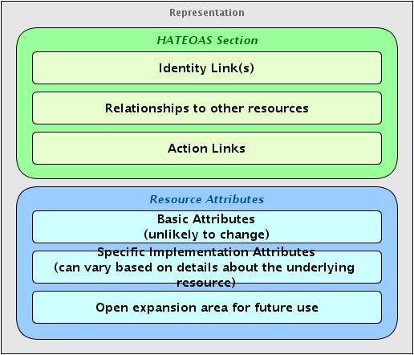

# Schema Design

-   [Planning the schema](#SchemaDesign-Planningtheschema)
-   [Sections explained in the representation schema](#SchemaDesign-Sectionsexplainedintherepresentationschema)
    -   [HATEOAS](#SchemaDesign-HATEOAS)
        -   [Identity Links](#SchemaDesign-IdentityLinks)
        -   [Relationship Links](#SchemaDesign-RelationshipLinks)
        -   [Action Links](#SchemaDesign-ActionLinks)
    -   [Resource Attributes](#SchemaDesign-ResourceAttributes)
        -   [Basic Attributes](#SchemaDesign-BasicAttributes)
        -   [Implementation Specific Attributes](#SchemaDesign-ImplementationSpecificAttributes)
        -   [Open Expansion Area](#SchemaDesign-OpenExpansionArea)
-   [Representation of common data types](#SchemaDesign-Representationofcommondatatypes)
    -   [Dates, Times, and Timestamps](#SchemaDesign-Dates,Times,andTimestamps)
    -   [Currency and Money Values](#SchemaDesign-CurrencyandMoneyValues)
    -   [Resource Identifiers](#SchemaDesign-ResourceIdentifiers)
    -   [Numbers (Integers, Floating Points, Fixed Points)](#SchemaDesign-Numbers(Integers,FloatingPoints,FixedPoints))
-   [Common patterns](#SchemaDesign-Commonpatterns)
-   [Examples](#SchemaDesign-Examples)
-   [Common problems and solutions](#SchemaDesign-Commonproblemsandsolutions)

## Planning the schema

## Sections explained in the representation schema

### HATEOAS

#### Identity Links

#### Relationship Links

#### Action Links

### Resource Attributes

#### Basic Attributes

#### Implementation Specific Attributes

#### Open Expansion Area

## Representation of common data types

### Dates, Times, and Timestamps

### Currency and Money Values

### Resource Identifiers

### Numbers (Integers, Floating Points, Fixed Points)

## Common patterns

## Examples

## Common problems and solutions
