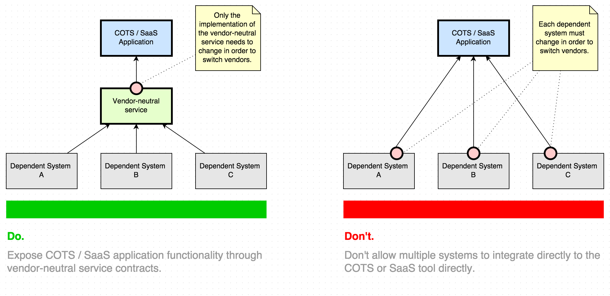
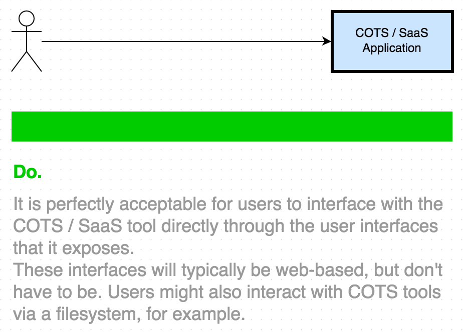
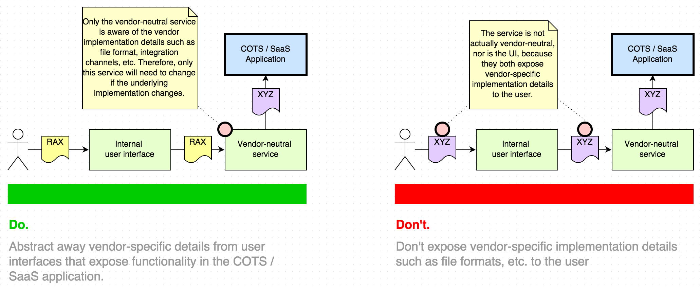

# Wrapping Vendor Applications

## problem

You want to integrate to a COTS (commercial off the shelf) or SaaS (software as a service) application.  How do you do so in a way that limits coupling and maximizes vendor diversification options?

## Guidelines

1. Encapsulate the COTS / SaaS application with a vendor-neutral service contract using the [legacy wrapper pattern](http://soapatterns.org/design_patterns/legacy_wrapper).
2. Ensure that internal systems only couple to this abstraction rather than permitting them to couple to the vendor contract / implementation directly.  
3. Use the [service agent pattern](http://soapatterns.org/design_patterns/service_agent) to react to outbound messages that originate in the COTS / SaaS application, adapting these messages to the vendor-neutral format specified by your vendor-neutral contract.

## Standards

None at this time.

## Discussion

### Maximizing vendor diversification options

Services should always abstract and hide vendor-specific implementation details through well
designed, vendor-agnostic service contracts. This allows us to mix-and-match a variety of
vendors in our service inventory while still enjoying the benefits of intrinsic
interoperability. In addition, services that abstract vendor implementation details can
later be refactored to use different vendor technologies with minimal impact to their
existing consumers. While such changes are typically time-consuming and costly, in some cases
they will be unavoidable (e.g., if we find a critical flaw in a vendor’s product). Therefore,
it is absolutely critical that our services are built to embrace this goal and can easily
support such changes.

The goal here is to avoid a situation in which many clients have a direct dependency on the COTS or SaaS application.  Each direct integration will be impacted should you choose to switch vendors. Therefore, use the [legacy wrapper pattern](http://soapatterns.org/design_patterns/legacy_wrapper) to encapsulate the COTS / SaaS application in a vendor-neutral contract that internal clients can safely couple to.

### Enabling loose coupling

The types of coupling to avoid here are:

* **Contract-to-logic** - A service contract should never depend on the details of its
                          underlying implementation. For example, a ProcessInvoice task service that exposes fine-grained service capabilities such as BeginProcessing, FinishProcessing, etc. has high Contract-to-Logic coupling. Reducing this coupling would involve replacing these capabilities with a single Execute capability that hides the algorithmic steps behind the service contract.
* **Contract-to-implementation** - This is similar to contract-to-logic coupling, but ties
                          service contracts to underlying infrastructure implementation details such as database tables or message queues. This form of coupling should also be avoided.
* **Contract-to-technology** - Service contracts should not be coupled to any particular
                          implementation platform or vendor application. Instead, contracts should be exposed to consumers using a technology-agnostic contract and should never expose any details that would allow a consumer to detect the underlying technologies used to implement the service.
* **Consumer-to-implementation** - A service’s implementation should always be accessed through
                          its contract. Service consumers that bypass a service contract to directly access its implementation details (e.g., by directly accessing an underlying database) become tightly coupled to those details and compromise the autonomy of the service, thereby violating the Service Autonomy design principle. This is a negative form of coupling that should always be avoided.

#### Avoiding Contract-to-logic, Contract-to-implementation and Contract-to-technology coupling

These types of coupling are similar. The underlying principle here is that a service contract should never depend on the details of its underlying implementation.  So the vendor-neutral service contract should be developed with business needs in mind, rather than be tailored to the integration mechanisms offered by the COTS or SaaS application.  

When developing a service, the initial focus should always be on contract-first design and the
identification of business processes via top-down analysis. This will ensure that the service contract is closely aligned with the needs of the business. Once the contract is defined, its capabilities can then be implemented in terms of the vendor-specific APIs exposed by the COTS product. Under no circumstances should a service contract expose vendor-specific details to its consumers.

#### Avoiding Consumer-to-implementation coupling

The goal here is to make sure that clients access the COTS or SaaS application via our vendor-neutral contract, rather than integrating to some aspect of the application's implementation directly.

##### Outbound messaging that originates in the COTS / SaaS application

This is pretty straightforward for situations where the client initiates the communication: the client can just call our abstract service's API. However, when your COTS / SaaS tool needs to initiate communication in an outbound fashion (e.g. for event-driven messaging), the solution isn't as obvious. In these cases, use the [service agent pattern](http://soapatterns.org/design_patterns/service_agent).

##### File-based interaction
In cases where the COTS / SaaS solution interacts by exchanging files, please refer to the [file gateway pattern](http://soapatterns.org/design_patterns/file_gateway), which is the same idea, but is more specific to file-based interaction.  

##### Users are consumers too

You may find that one of the reasons to opt for a COTS or SaaS solution in the first place is to leverage the interface provided by that applications for your users, rather than having to create a new user interface yourself.  

For example, for your billing application, you may have a vendor-agnostic API to add charges to an invoice, but may wish to utilize a vendor-specific user interface for billing related business functions performed by a specific billing team.

In this case, consumer-to-implementation coupling may be acceptable for this set of users, but recognize that this coupling will make vendor diversification more difficult to achieve because the teams coupled to the vendor's user interfaces will be affected by vendor changes in the future.

On the other hand, if you wish to offer users a more standard web-based user interface such as a web view in an internal, vendor-agnostic portal, then details about the underlying implementation should not be exposed to the user, nor to the intermediate systems that offer the functionality to the user.  That is, the user interface should not expose vendor-specific contract or implementation details such as file formats or filenames, etc.

